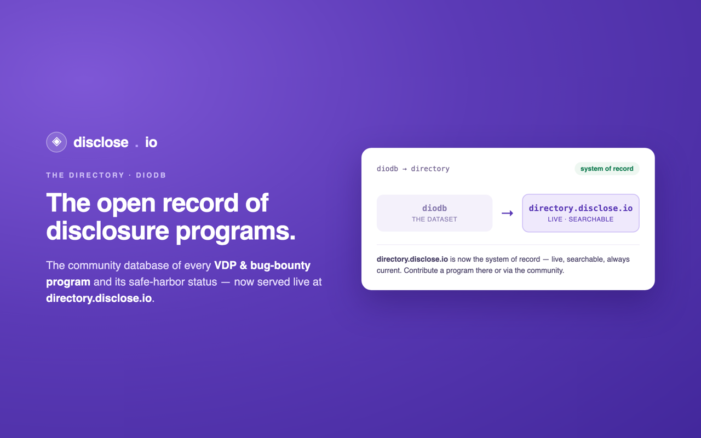

# diodb

### The community database of every **VDP &amp; bug-bounty program** and its safe-harbor status — now served live at [directory.disclose.io](https://directory.disclose.io).

*Part of **[the disclose.io Project](https://disclose.io)** — the open, vendor-neutral infrastructure for vulnerability disclosure. [Browse the ecosystem →](https://github.com/disclose)*

---

> [!IMPORTANT]
> **[directory.disclose.io](https://directory.disclose.io) is now the system of record** — live, searchable, and always current. This repository remains as the open dataset and its history. To add or update a program, use the [directory](https://directory.disclose.io) or the [community forum](https://community.disclose.io).

## About this dataset

### Quick links

|Purpose|Link|
|-|-|
| Search through the database front-end  | [https://disclose.io/programs](https://disclose.io/programs)  |
| Download the raw database in .json format  | [https://github.com/disclose/diodb/raw/master/program-list.json](https://github.com/disclose/diodb/raw/master/program-list.json)  |
| Generate your own Vulnerability Disclosure Program | [https://policymaker.disclose.io/](https://policymaker.disclose.io/) |
| Join disclose.io Community Forum  | [https://community.disclose.io](https://community.disclose.io) |
| Learn more about Vulnerability Disclosure Programs (VDP) | [https://github.com/disclose/dioterms](https://github.com/disclose/dioterms) |

### Why does diodb exist?

diodb exists to drive the adoption of Safe Harbor for hackers and promote the cybersecurity posture of early adopters, simplify the process of finding the right contacts and channel at an organization, and help both finders and vendors align around the expectations of engagement. It also provides a simple, vendor-agnostic point of engagement for program operators, potential program operators, and the security community to maintain updates to their program. 

## How to Contribute

Contributions are very welcome! You may add a new program or update an existing one by either opening an issue or a pull request.

[Open an Issue](https://github.com/disclose/diodb/issues/new/choose)

or

Follow [the contribution guidelines](CONTRIBUTING.md) to prepare and open a Pull Request

## License

 disclose by <a xmlns:cc="http://creativecommons.org/ns#" href="https://disclose.io" property="cc:attributionName" rel="cc:attributionURL">disclose.io</a> is licensed under a <a rel="license" href="http://creativecommons.org/licenses/by/4.0/">Creative Commons Attribution 4.0 International License</a>.
